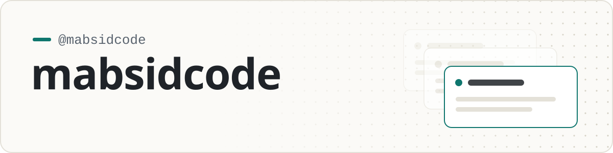

<!--
  Profile README for @mabsidcode.
  Everything outside the START/END markers is hand-written: edit it freely.
  Blocks between markers are regenerated by .github/workflows/update-profile.yml;
  change them through profile.config.json instead of editing them here.
-->

<!-- HEADER:START -->
<!-- Generated by scripts/update-profile.mjs. Edits inside this block are overwritten; use profile.config.json. -->

<picture>
  <source media="(prefers-color-scheme: dark)" srcset="assets/banner-dark.svg">
  
</picture>

<!-- HEADER:END -->

<!-- ✍️ Your intro: two or three sentences in your own words about what you build,
     what you're exploring right now, and what kind of collaboration you're open to. -->

Software developer focused on building practical, well-crafted tools. I care about clean code, thoughtful design and shipping work that holds up over time. Always open to interesting ideas and collaboration, so feel free to open an issue or start a discussion on any of my projects.

<!-- PROJECTS:START -->
<!-- Generated by scripts/update-profile.mjs. Edits inside this block are overwritten; use profile.config.json. -->

## Projects

New public repositories appear here automatically.

<!-- PROJECTS:END -->

<!-- LANGUAGES:START -->
<!-- Generated by scripts/update-profile.mjs. Edits inside this block are overwritten; use profile.config.json. -->
<!-- LANGUAGES:END -->

 

  If something here is useful to you, a ⭐ on the repo helps other people find it.

