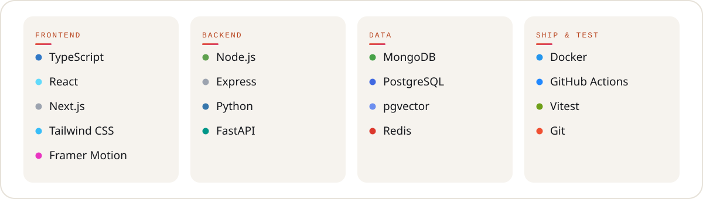

<!--
  Generated by scripts/build.mjs from profile.config.json.
  Don't edit this file by hand: change the config and run `npm run build`
  (or push, and the GitHub Action rebuilds it for you).
-->

<a href="https://github.com/mabsidcode">
<picture>
  <source media="(prefers-color-scheme: dark)" srcset="assets/hero-dark.svg">
  
</picture>
</a>

## Hey, I'm Siddique 👋

I'm a full-stack developer building tools for the people most software forgets: first-time form fillers, people who would rather speak than type, and anyone who doesn't read English first. My work sits where TypeScript frontends, Node and Python backends, and LLMs meet.

<table><tr><td>

**Right now**

- 🛠️ **Building** FormFix AI: upload any official form and get it explained, field by field, in plain language
- 🎙️ **Shipping** AVSAR for Smart India Hackathon: a voice assistant that turns a spoken goal into a skilling plan
- 🔍 **Exploring** speech pipelines, retrieval that cites its sources, and guardrails that keep LLMs honest
- 🤝 **Open to** collaborating on anything multilingual, accessible, or AI-shaped

</td></tr></table>

## What I'm building

<picture>
  <source media="(prefers-color-scheme: dark)" srcset="assets/cards/formfix-ai-dark.svg">
  
</picture>
<picture>
  <source media="(prefers-color-scheme: dark)" srcset="assets/cards/avsar-dark.svg">
  
</picture>

## Toolbox

<picture>
  <source media="(prefers-color-scheme: dark)" srcset="assets/stack-dark.svg">
  
</picture>

 

Got an idea, a bug, or a form that makes no sense? Open an issue on any repo, I read them all.

<picture>
  <source media="(prefers-color-scheme: dark)" srcset="assets/footer-dark.svg">
  
</picture>
